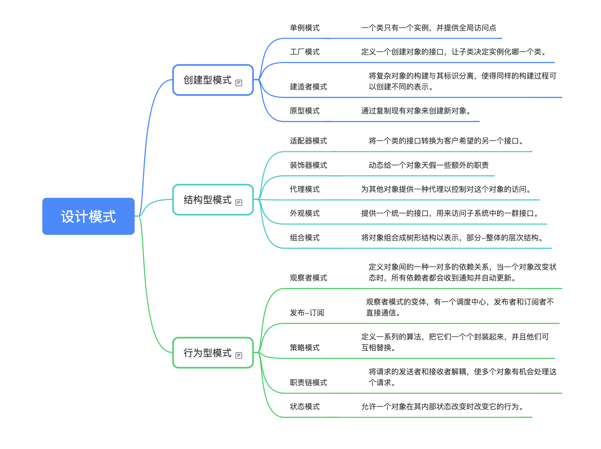

## 脑图




## 设计模式的三大类
设计模式更具目的被分为创建型，结构型和行为型三大类。它们的根本区别在于它们所解决的问题类型和承担的职责。
- 创建型：关心的是对象的创建，如何创建对象；
- 结构型：关心的是对象的组合，如何组装成更大的结构；
- 行为型：关心的是对象的写作，如何交互，如何分配职责；

### 创建型
将对象的实力话过程抽象出来，使得系统不依赖于对象创建的具体细节。这提高了系统的灵活性，因为创建新对象类型变得更容易。

#### 单例模式
确保一个类只有一个实例，并提供一个全局访问点。

在vue中的使用场景
1. 全局状态管理
2. 全局时间总栈 EventBus

```js
class Singleton {
    constructor() {
        if(!Singleton.instance) {
            Singleton.instance = this
        }
        return Singleton.instance
    }
}

const instance1 = new Singleton()
const instance2 = new Singleton()

instance1 === instance2 // true
```


#### 工厂方法模式
定义一个用于创建对象的接口，但让子类决定实例化哪个类。工厂方法使一个类的实力话延迟到其子类。

#### 建造者模式
将一个复杂对象的构建与其表示分离，使得同样的构建过程可以创建不同的表示。

#### 原型模式
用原型实例制定创建对象的种类，并且通过拷贝这些原型来创建新的对象。


### 结构型
通过组合类或对象来获得更大，更灵活的结构。它们主要关注如何简化系统结构，降低不同模块间的耦合度。

#### 适配器模式
将一个类的接口转换成客户希望的另一个接口。使得原本由于接口不兼容而不能一起工作的那些类可以一起工作。

#### 装饰器模式
动态给一个对象添加一些额外的职责。就增加功能来说，装饰器模式比生成子类更为灵活。

#### 代理模式
为其他对象提供一种代理以控制对这个对象的访问。

#### 外观模式
为子系统中的一组接口提供一个一致的高层接口，使得这子系统更加容易使用。

### 行为模式
不仅描述对象或类的模式，还描述它们之间的通信模式，它们关注的是职责的分配和算法的流程。

#### 观察者模式
定义对象间的一种一对多的依赖关系，当一个对象的状态发生改变时，所有依赖于它的对象都会得到通知并被自动更新。

#### 策略模式
定义一系列的算法，把它们一个个封装起来，并且使它们可以互相替换，改模式使得算法可以独立于使用它们的客户而变化。

